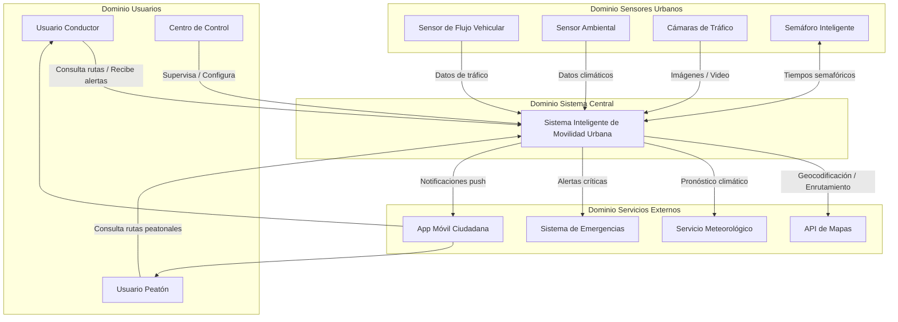
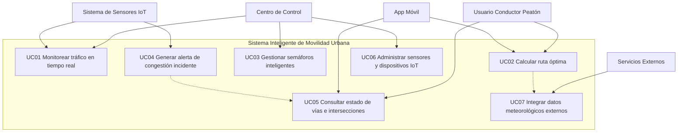
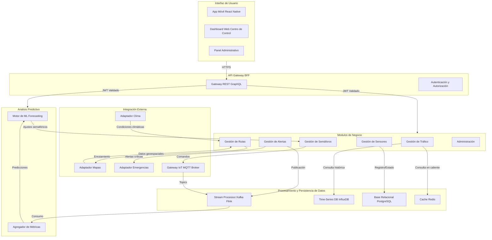
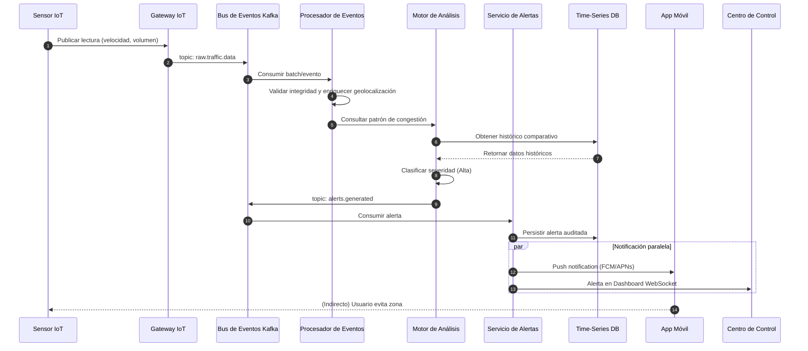
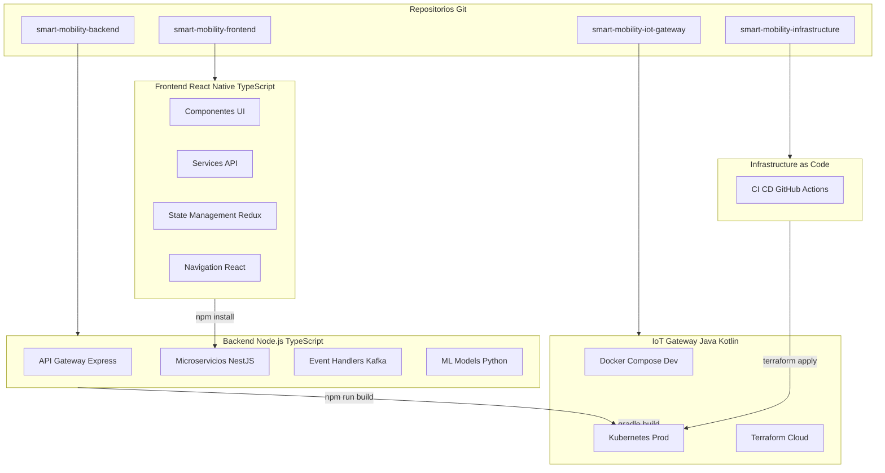
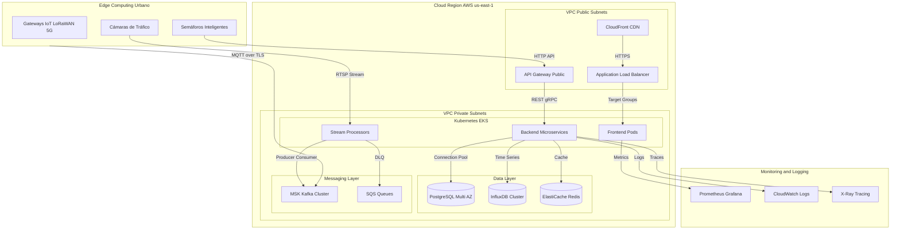

# Actividad Individual N° 1
## Taller de Modelado y Representación Arquitectónica del Sistema

**Asignatura:** Arquitectura de Software  
**Caso:** Sistema Inteligente de Movilidad Urbana (Smart Mobility System)  
**Enfoque metodológico:** Modelo 4+1 de Kruchten (1995) e ISO/IEC/IEEE 42010  
**Referencia:** Módulo Arquitectura de Software – Universidad de Manizales

---

## 1. Introducción

La arquitectura de software constituye el pilar fundamental sobre el cual se construyen soluciones informáticas modernas. Según Bass, Clements y Kazman (2013), la arquitectura puede entenderse como "la organización estructural de un sistema, compuesta por elementos de software, sus propiedades visibles y las relaciones que se establecen entre dichos componentes" (p. 3). En este sentido, el arquitecto de software debe traducir las necesidades del negocio —en este caso, la gestión inteligente de la movilidad urbana— en una solución técnica preliminar que permita estimar esfuerzos, mitigar riesgos y garantizar atributos de calidad desde las etapas iniciales del desarrollo (Sommerville, 2016, p. 24).

El presente documento especifica la arquitectura de un Sistema Inteligente de Movilidad Urbana, aplicando el modelo de vistas 4+1 de Kruchten (vista de escenarios, vista lógica, vista de procesos, vista de desarrollo/implementación y vista física/despliegue), complementado con la vista conceptual y alineado con los lineamientos del estándar ISO/IEC/IEEE 42010 para la descripción de arquitecturas de software (ISO/IEC/IEEE 42010, 2011, p. 2).

---

## 2. Fase 1: Especificación de Requisitos del Sistema

### 2.1. Identificación de Módulos Funcionales

Siguiendo el principio de separación de responsabilidades y descomposición modular (Parnas, 1972, citado en el módulo, p. 11), el sistema se organiza en los siguientes módulos funcionales:

### 2.2. Especificación de Requisitos Funcionales

#### Módulo: Gestión del Tráfico (MF-01)
- **RF-01.** El sistema deberá monitorear el tráfico en tiempo real mediante datos provenientes de sensores de flujo vehicular y cámaras.
- **RF-02.** El sistema deberá detectar congestiones automáticamente cuando la velocidad promedio en un tramo sea inferior a un umbral configurable.
- **RF-03.** El sistema deberá calcular el nivel de servicio (LoS, Level of Service) de cada intersección monitorizada.
- **RF-04.** El sistema deberá almacenar históricos de tráfico para análisis de patrones.

#### Módulo: Gestión de Semáforos Inteligentes (MF-02)
- **RF-05.** El sistema deberá ajustar los tiempos de los semáforos de forma adaptativa según la densidad vehicular detectada.
- **RF-06.** El sistema deberá permitir la configuración de planes semafóricos programados por horarios (modo horario).
- **RF-07.** El sistema deberá priorizar el paso de vehículos de emergencia cuando se reciba una señal de prioridad.
- **RF-08.** El sistema deberá reportar el estado operativo de cada semáforo (activo, apagado, en fallo).

#### Módulo: Gestión de Rutas (MF-03)
- **RF-09.** El sistema deberá calcular rutas óptimas considerando distancia, tiempo estimado y condiciones de tráfico en tiempo real.
- **RF-10.** El sistema deberá actualizar las rutas sugeridas cuando se detecten nuevas congestiones o cierres viales.
- **RF-11.** El sistema deberá ofrecer rutas multimodales (vehículo particular, transporte público, peatón).
- **RF-12.** El sistema deberá integrar datos de servicios externos de mapas para geocodificación y enrutamiento base.

#### Módulo: Gestión de Sensores Urbanos (MF-04)
- **RF-13.** El sistema deberá recibir datos de sensores heterogéneos (magnéticos, acústicos, visuales, ambientales).
- **RF-14.** El sistema deberá validar la integridad y frecuencia de los datos recibidos de cada sensor.
- **RF-15.** El sistema deberá permitir el registro, activación y desactivación remota de sensores.
- **RF-16.** El sistema deberá detectar fallos en sensores y generar alertas de mantenimiento.

#### Módulo: Gestión de Alertas e Incidentes (MF-05)
- **RF-17.** El sistema deberá generar alertas automáticas ante detección de congestiones, accidentes o anomalías en sensores.
- **RF-18.** El sistema deberá clasificar alertas por nivel de severidad (baja, media, alta, crítica).
- **RF-19.** El sistema deberá notificar alertas a usuarios finales (app móvil) y al Centro de Control.
- **RF-20.** El sistema deberá permitir al Centro de Control confirmar, escalar o descartar alertas generadas.

#### Módulo: Administración del Sistema (MF-06)
- **RF-21.** El sistema deberá gestionar perfiles de usuario (administrador, operador, ciudadano).
- **RF-22.** El sistema deberá generar reportes de tráfico, incidentes y estado de infraestructura.
- **RF-23.** El sistema deberá mantener una bitácora de auditoría de todas las acciones críticas.
- **RF-24.** El sistema deberá permitir la configuración de parámetros operacionales (umbrales, horarios, zonas).

### 2.3. Especificación de Requisitos No Funcionales

Los requisitos no funcionales constituyen atributos de calidad que condicionan las decisiones arquitectónicas (Bass et al., 2013, p. 63). Para este sistema se definen los siguientes:

- **RNF-01. Disponibilidad:** El sistema deberá garantizar una disponibilidad del 99.9%, especialmente durante horas pico, dado que la interrupción del servicio afecta directamente la seguridad vial y la operación de semáforos.
- **RNF-02. Rendimiento (Tiempo de respuesta):** El tiempo de respuesta para consultas de ruta no deberá superar los 2 segundos; el ajuste de semáforos deberá ejecutarse en menos de 500 ms desde la detección de densidad.
- **RNF-03. Escalabilidad:** El sistema deberá permitir escalabilidad horizontal para absorber el crecimiento del número de sensores IoT y usuarios concurrentes, sin reescritura de la solución (Richards & Ford, 2020, p. 147).
- **RNF-04. Seguridad:** Toda la comunicación entre sensores, backend y aplicaciones móviles deberá realizarse mediante protocolos seguros (TLS 1.3, MQTT sobre SSL); se implementará control de acceso basado en roles (RBAC) y auditoría de eventos.
- **RNF-05. Tolerancia a fallos:** El sistema deberá continuar operando ante la falla de nodos individuales o sensores, utilizando replicación de servicios y mecanismos de failover automático.
- **RNF-06. Interoperabilidad:** El sistema deberá integrarse con servicios externos de mapas (Google Maps, OpenStreetMap), pasarelas meteorológicas y sistemas de emergencia institucionales mediante APIs estándar (REST/JSON o GraphQL).
- **RNF-07. Mantenibilidad:** La arquitectura deberá favorecer la evolución independiente de módulos, permitiendo actualizar el algoritmo de rutas o el motor de semáforos sin afectar al resto del sistema.

---

## 3. Fase 2: Análisis del Sistema

### 3.1. Identificación de Actores

Los actores del sistema se clasifican en tres categorías principales:

#### Actores Humanos (Usuarios)
- **Usuario Conductor:** Conductor de vehículo particular que utiliza el sistema para obtener rutas óptimas y recibir alertas de tráfico.
- **Usuario Peatón:** Peatón que consulta información de movilidad urbana, rutas peatonales y estado de vías.
- **Operador del Centro de Control:** Personal encargado de monitorear el sistema, confirmar alertas y configurar parámetros operacionales.
- **Administrador del Sistema:** Usuario con privilegios para gestionar usuarios, configurar sistema y mantener infraestructura.

#### Actores Hardware/Sistemas (Sensores y Dispositivos)
- **Sensor de Flujo Vehicular:** Dispositivo IoT que mide volumen y velocidad de vehículos en tiempo real.
- **Sensor Ambiental:** Sensor que monitora condiciones climáticas y ambientales (temperatura, humedad, calidad del aire).
- **Cámaras de Tráfico:** Sistemas de visión artificial para detección visual de incidentes y monitoreo de flujo.
- **Semáforo Inteligente:** Actuador IoT que ajusta tiempos de semaforización según condiciones de tráfico.

#### Actores Sistemas Externos
- **Servicios de Mapas:** APIs externas (Google Maps, OpenStreetMap) para geocodificación y enrutamiento base.
- **Pasarelas Meteorológicas:** Sistemas externos que proporcionan datos climáticos precisos.
- **Sistemas de Emergencia:** Servicios institucionales de emergencias para integración de alertas críticas.

### 3.2. Funcionalidades Principales
- Monitoreo en tiempo real de la red vial mediante ingestión continua de datos IoT.
- Control adaptativo de semáforos basado en inteligencia de tráfico local y global.
- Cálculo y recomendación de rutas óptimas con actualización dinámica.
- Procesamiento de eventos para detección temprana de anomalías y congestiones.
- Generación y difusión de alertas multicanal (push, SMS, paneles de control).
- Análisis predictivo de demanda vehicular para planificación urbana.

### 3.3. Problemas que Resuelve el Sistema
- **Congestión vehicular crónica:** reduce tiempos de viaje mediante semáforos adaptativos y rutas alternativas.
- **Falta de visibilidad operativa:** el Centro de Control cuenta con un dashboard unificado del estado de la ciudad.
- **Respuesta tardía a incidentes:** la detección automática y notificación inmediata acorta los tiempos de reacción.
- **Ineficiencia energética y operativa:** los semáforos inteligentes minimizan tiempos de espera innecesarios.

### 3.4. Restricciones
- **Restricción temporal (tiempo real):** El procesamiento de datos de sensores y el ajuste de semáforos deben cumplir latencias estrictas (< 500 ms).
- **Restricción de disponibilidad:** El sistema debe operar 24/7/365 con interrupciones mínimas.
- **Restricción tecnológica:** Debe soportar hardware IoT heterogéneo y conectividad variable (4G/5G, LoRaWAN, WiFi).
- **Restricción normativa:** Cumplimiento de leyes de protección de datos personales (datos de geolocalización de usuarios).
- **Restricción presupuestal:** Infraestructura preferentemente cloud con modelo de pago por uso para optimizar costos operativos.

---

## 4. Fase 3: Construcción de Vistas Arquitectónicas

"Ningún sistema puede ser descrito adecuadamente mediante una única representación. Las vistas arquitectónicas permiten descomponer la complejidad del sistema en diferentes dimensiones, facilitando su análisis y comprensión" (Kruchten, 1995; adaptado del módulo, p. 60).

A continuación se presentan las vistas solicitadas, fundamentadas en el modelo 4+1 de Kruchten y en los diagramas UML estandarizados (Jacobson, Booch & Rumbaugh, 1999).

### Convenciones de Notación para Diagramas

**Símbolos utilizados en diagramas Mermaid:**
- `-->` : Flujo de datos o comunicación unidireccional
- `-.->` : Dependencia o relación indirecta
- `-->>` : Retorno de datos o respuesta
- `subgraph` : Agrupación de componentes relacionados
- `[ ]` : Componentes o nodos del sistema
- `( )` : Base de datos o almacenamiento
- emojis (🎨, ⚙️, 📡, etc.) : Identificación visual de dominios/capas

**Tipos de diagramas:**
- `flowchart TB` : Diagrama de flujo (Top-Bottom) para arquitectura estática
- `graph TD` : Grafo dirigido (Top-Down) para relaciones estructurales
- `sequenceDiagram` : Diagrama de secuencia para interacciones temporales

### 4.1. Vista Conceptual (Diagrama de Contexto / Gran Fotografía)

**Propósito:** Presentar el alcance del sistema, identificar actores y sistemas externos clave, y ubicar la solución dentro de su entorno organizacional y tecnológico (módulo, p. 94). Esta vista responde a la pregunta: ¿Cuál es el territorio del sistema?

**Decisiones arquitectónicas evidenciadas:**
- Separación clara entre dominios de responsabilidad (usuarios, sensores, lógica central, externos).
- El sistema central actúa como orquestador, desacoplando sensores y servicios externos del usuario final.
- Se establecen interfaces externas estandarizadas (APIs REST) para garantizar interoperabilidad (RNF-06).

**Leyenda del diagrama:**
- **DominiosUsuarios**: Actores humanos que interactúan con el sistema
- **DominiosSensores**: Dispositivos IoT que generan datos de tráfico
- **DominiosCentral**: Sistema core que procesa y orquesta
- **DominiosExternos**: Servicios de terceros integrados al sistema

### 4.2. Vista de Casos de Uso (Escenarios)

**Nota de visualización:** Los diagramas Mermaid incluidos en este documento requieren un visor compatible (como GitHub, GitLab, VS Code con extensión Mermaid, o herramientas como Mermaid Live Editor) para su correcta renderización. En visores de git que no soporten Mermaid, el diagrama aparecerá como código.

**Propósito:** Articular las demás vistas mediante escenarios reales de uso. Conecta la arquitectura con la experiencia operativa de los actores y permite validar que la solución responde a los requerimientos funcionales y no funcionales (Kruchten, 1995, p. 60; módulo, p. 99).

**Especificación narrativa de casos arquitectónicamente significativos:**

#### UC04: Generar alerta de congestión/incidente

1. El sensor IoT detecta una anomalía (velocidad < umbral o accidente visual).
2. El Gateway IoT publica el evento en el bus de mensajes.
3. El Procesador de Eventos valida y enriquece la alerta con contexto geoespacial.
4. El Motor de Análisis clasifica la severidad (media/alta/crítica).
5. El Servicio de Alertas notifica al Centro de Control y a usuarios en la zona vía App Móvil.
6. El sistema registra la alerta en la base de datos para auditoría.

**Atributos de calidad involucrados:** Rendimiento (procesamiento en < 2 s), Disponibilidad (24/7), Seguridad (canal cifrado).

### 4.3. Vista Lógica (Estructura Funcional Interna)

**Propósito:** Describir la organización funcional del sistema, mostrando los principales paquetes/componentes, sus responsabilidades y relaciones de dependencia (módulo, p. 101-104). Responde a: ¿Cómo está organizado internamente el sistema?

**Decisiones arquitectónicas evidenciadas:**
- **Arquitectura basada en microservicios/modular:** Cada módulo de negocio puede desarrollarse, desplegarse y escalar de manera autónoma (Richards & Ford, 2020, p. 147), satisfaciendo RNF-03 (escalabilidad) y RNF-07 (mantenibilidad).
- **API Gateway:** Centraliza autenticación, autorización (RNF-04) y enrutamiento a microservicios.
- **Procesamiento de eventos (Kafka/Flink):** Desacopla la ingestión masiva de sensores del procesamiento de negocio, garantizando tolerancia a fallos (RNF-05) y rendimiento (RNF-02).
- **Separación de bases de datos especializadas:** Time-Series para métricas IoT, Relacional para datos transaccionales, Cache para rutas frecuentes.

**Leyenda del diagrama:**
- **UI**: Capa de interfaz de usuario (móvil, web, admin)
- **API**: Gateway y capa de seguridad
- **CORE**: Módulos de negocio principales
- **ANALYTICS**: Componentes de análisis predictivo
- **INTEGRATION**: Adaptadores para sistemas externos
- **DATA**: Capa de procesamiento y persistencia de datos

### 4.4. Vista de Procesos (Comportamiento Dinámico)

**Propósito:** Describir el comportamiento dinámico del sistema, especialmente en términos de concurrencia, sincronización, interacción temporal y coordinación entre procesos o servicios (Kruchten, 1995; módulo, p. 105-108). Responde a: ¿Cómo interactúan los componentes en tiempo de ejecución?

**Escenario modelado:** Detección de congestión y generación de alerta

**Análisis de la secuencia:**
- **Asincronía:** Las etapas de ingestión (1-2) y procesamiento (3-8) son asincrónicas mediante el bus de eventos, evitando que la caída de un componente bloquee el flujo completo (RNF-05).
- **Concurrencia:** El paso 11 muestra notificación paralela a múltiples actores, lo que exige mecanismos de gestión de hilos y colas de mensajes.
- **Persistencia transaccional:** La alerta se almacena antes de notificar (paso 10), garantizando trazabilidad y no repudio (RNF-04).
- **Tolerancia a fallos parciales:** Si la App Móvil no recibe el push, la alerta permanece en el Centro de Control gracias al desacoplamiento.

### 4.5. Vista de Desarrollo/Implementación (Organización del Código)

**Propósito:** Describir la organización del código fuente, dependencias entre módulos, configuración de build y gestión de versiones (Kruchten, 1995; módulo, p. 108-110). Responde a: ¿Cómo está estructurado el código y cómo se gestiona su desarrollo?

**Decisiones de desarrollo:**
- **Monorepo vs. Multirepo:** Se adopta estrategia multirepo para separar responsabilidades: frontend, backend, IoT gateway e infraestructura, permitiendo ciclos de release independientes (RNF-07).
- **Tecnologías por capa:** TypeScript para consistencia type-safe entre frontend y backend; Python para modelos de ML; Java/Kotlin para edge computing en gateways IoT.
- **CI/CD:** GitHub Actions para automatizar testing, linting y despliegue; pipelines separados por repositorio con triggers de release semánticos.
- **Gestión de dependencias:** npm para ecosistema JavaScript/TypeScript; gradle para IoT; pip para modelos ML; control de versiones via semantic versioning.

**Leyenda del diagrama:**
- **REPOS**: Estructura de repositorios Git
- **FRONTEND**: Aplicación móvil React Native/TypeScript
- **BACKEND**: Servicios backend Node.js/TypeScript y Python
- **IOT**: Gateway IoT Java/Kotlin para dispositivos
- **INFRA**: Configuración de infraestructura como código

### 4.6. Vista Física/Despliegue (Infraestructura de Producción)

**Propósito:** Describir la topología de hardware, nodos de computación, configuración de red y distribución de componentes en la infraestructura física o cloud (Kruchten, 1995; módulo, p. 111-113). Responde a: ¿Dónde se ejecutan los componentes y cómo se comunican?

**Decisiones de despliegue:**
- **Edge Computing:** Gateways IoT procesan datos localmente para reducir latencia y ancho de banda, enviando solo eventos relevantes al cloud (RNF-02).
- **Cloud-native:** Kubernetes (EKS) para orquestación de contenedores, permitiendo escalabilidad automática basada en métricas de tráfico (RNF-03).
- **Alta disponibilidad:** Multi-AZ deployment, load balancers, bases de datos con replicación y failover automático (RNF-01, RNF-05).
- **Seguridad por capas:** VPC con subnets públicas/privadas, security groups, WAF, y comunicación cifrada end-to-end (RNF-04).
- **Observabilidad:** Stack completo de monitoring (Prometheus/Grafana), logging centralizado (CloudWatch) y tracing distribuido (X-Ray).

**Leyenda del diagrama:**
- **EDGE**: Dispositivos IoT y gateways en locaciones urbanas
- **CLOUD_REGION**: Infraestructura cloud en región AWS específica
- **VPC_PUBLIC**: Subnets públicas para componentes accesibles externamente
- **VPC_PRIVATE**: Subnets privadas para componentes internos seguros
- **K8S_CLUSTER**: Cluster Kubernetes para orquestación de contenedores
- **DATA_LAYER**: Servicios de bases de datos y almacenamiento
- **MESSAGING**: Capa de mensajería y colas de eventos
- **MONITORING**: Servicios de monitoreo, logging y tracing

---

## 5. Fase 4: Análisis Arquitectónico

### 5.1. ¿Por qué son necesarias múltiples vistas?

Según el modelo 4+1 de Kruchten (1995) y el estándar ISO/IEC/IEEE 42010 (2011), ningún sistema puede describirse adecuadamente desde una única perspectiva (módulo, p. 60). Cada stakeholder posee preocupaciones (concerns) distintas: el usuario final se interesa por la funcionalidad (vista de casos de uso), el desarrollador por la organización del código (vista lógica/implementation), el administrador de infraestructura por el despliegue físico (vista de despliegue) y el analista de negocio por el contexto general (vista conceptual).

La utilización de múltiples vistas permite:
1. **Separación de preocupaciones:** Cada vista aborda un aspecto específico sin sobrecargar al lector con información irrelevante para su rol (módulo, p. 72-73).
2. **Gestión de la complejidad:** Descompone un sistema distribuido y altamente concurrente en representaciones comprensibles (Bass et al., 2013, p. 18).
3. **Trazabilidad:** Facilita rastrear cómo un requisito funcional (ej. "generar alerta") se traduce en componentes lógicos, procesos en ejecución y nodos de despliegue (módulo, p. 129).

### 5.2. ¿Qué representa cada vista?

Cada vista arquitectónica proporciona una perspectiva específica del sistema, enfocada en las preocupaciones de diferentes stakeholders:

- **Vista Conceptual (4.1):** Representa el contexto del sistema en su entorno operativo. Muestra los actores externos (usuarios, sensores, servicios) y sus relaciones de alto nivel con el sistema central. Es fundamental para analistas de negocio y stakeholders no técnicos para entender el alcance y límites del sistema.

- **Vista de Casos de Uso (4.2):** Describe la funcionalidad del sistema desde la perspectiva de los usuarios. Define qué hace el sistema en términos de objetivos de negocio (monitorear tráfico, calcular rutas, generar alertas). Sirve como puente entre requisitos funcionales y diseño técnico.

- **Vista Lógica (4.3):** Representa la estructura interna del sistema en términos de componentes, módulos y sus dependencias. Muestra cómo está organizado el código (microservicios, capas, bases de datos) y es esencial para desarrolladores y arquitectos de software.

- **Vista de Procesos (4.4):** Describe el comportamiento dinámico y la interacción temporal entre componentes. Muestra flujos de ejecución, concurrencia, sincronización y manejo de eventos. Es crítica para entender aspectos no funcionales como rendimiento y tolerancia a fallos.

- **Vista de Desarrollo/Implementación (4.5):** Representa la organización del código fuente, dependencias, herramientas de build y configuración de desarrollo. Es fundamental para equipos de desarrollo y DevOps para entender la estructura del proyecto y gestión de versiones.

- **Vista Física/Despliegue (4.6):** Describe la topología de hardware, nodos de computación, configuración de red y distribución de componentes en infraestructura. Es esencial para administradores de sistemas y equipos de operaciones para entender el despliegue y escalabilidad.

Las vistas no son diagramas aislados, sino representaciones complementarias que, en conjunto, describen el sistema de forma integral (módulo, p. 50, 72):

- La vista conceptual define **quién** interactúa con el sistema (usuarios, sensores, mapas).
- La vista de casos de uso define **qué** hace el sistema desde la perspectiva de esos actores (monitorear, alertar, enrutar).
- La vista lógica define **cómo** se organiza internamente para cumplir esas funciones (microservicios de tráfico, rutas, alertas).
- La vista de procesos define **cuándo** y en qué orden interactúan esos componentes durante la operación (flujo de detección de congestión).

Por ejemplo, el caso de uso UC04 (Generar alerta) se descompone en el componente Servicio de Alertas (vista lógica), el cual participa en una secuencia temporal específica con el Motor de Análisis y la App Móvil (vista de procesos). Sin esta articulación, la arquitectura sería un conjunto de cajas sin comportamiento.

### 5.4. ¿Qué vista resultó más compleja y por qué?

La vista de procesos resultó la más compleja de modelar. Las razones, alineadas con el marco teórico del módulo, son:

- **Concurrencia y sincronización:** El sistema debe procesar miles de eventos simultáneos provenientes de sensores distribuidos geográficamente. Modelar cómo el Stream Processor maneja particiones de Kafka sin perder orden ni duplicar alertas exige comprender mecanismos de concurrencia avanzada (módulo, p. 65-66).
- **Comunicación asincrónica vs. sincrónica:** Decidir qué interacciones deben ser sincrónicas (autenticación) y cuáles asincrónicas (notificación de alertas) implica analizar trade-offs entre latencia percibida y consistencia de datos (Richards & Ford, 2020, p. 158; módulo, p. 107).
- **Tolerancia a fallos parciales:** En un entorno IoT, es inevitable que sensores fallen o que la red móvil del usuario se interrumpa. La vista de procesos debe explicitar mecanismos de reintentos, circuit-breakers y persistencia temporal de respuestas (análogo al manejo de evaluaciones en línea del módulo, p. 107), lo que incrementa la complejidad del modelo dinámico.
- **Integración con sistemas externos:** La latencia y disponibilidad de servicios externos (pasarela de mapas, clima) no están bajo control del sistema, por lo que la vista de procesos debe incluir manejo de timeouts y degradación graceful (módulo, p. 108).

---

## 6. Conclusiones

- **Arquitectura como mediación estratégica:** La arquitectura de software no es una colección decorativa de diagramas, sino un mecanismo de traducción entre los objetivos del negocio (movilidad eficiente, seguridad vial) y las decisiones técnicas (microservicios, procesamiento de eventos, escalabilidad horizontal) (Rozanski & Woods, 2012, p. 33; módulo, p. 82).
- **Atributos de calidad como motores de decisión:** La selección de una arquitectura desacoplada basada en eventos y el uso de bases de datos especializadas no responden a una moda tecnológica, sino a la necesidad explícita de garantizar disponibilidad, rendimiento y tolerancia a fallos desde el diseño (Bass et al., 2013, p. 63; módulo, p. 96).
- **Naturaleza iterativa del diseño arquitectónico:** La arquitectura presentada es una propuesta preliminar que debe refinarse a medida que se identifiquen restricciones de infraestructura, volumetría real de sensores y patrones de tráfico locales. Como señala Kruchten (1995), la arquitectura evoluciona mediante iteraciones que validan decisiones y reducen riesgos técnicos (módulo, p. 38, 46).
- **Documentación como activo organizacional:** Siguiendo el estándar ISO/IEC/IEEE 42010, la especificación arquitectónica estructurada en vistas permite preservar el conocimiento, reducir la dependencia de personas específicas y facilitar la comunicación entre actores diversos (módulo, p. 126). Esto es especialmente crítico en sistemas de ciudad inteligente, donde intervienen múltiples proveedores tecnológicos y entidades gubernamentales.
- **Gestión de tensiones (trade-offs):** Una arquitectura valiosa no es la más compleja, sino aquella que gestiona conscientemente las tensiones entre escalabilidad y costo, entre seguridad y usabilidad, y entre latencia y consistencia. En este caso, la decisión de utilizar comunicación asincrónica para alertas mejora la escalabilidad pero exige mayor inversión en observabilidad y trazabilidad (módulo, p. 84).

---

## Referencias Bibliográficas del Módulo

- Bass, L., Clements, P., & Kazman, R. (2013). *Software architecture in practice* (3rd ed.). Addison-Wesley.
- ISO/IEC/IEEE. (2011). *ISO/IEC/IEEE 42010: Systems and software engineering — Architecture description.*
- Jacobson, I., Booch, G., & Rumbaugh, J. (1999). *The unified software development process.* Addison-Wesley.
- Kruchten, P. (1995). The 4+1 view model of architecture. *IEEE Software, 12*(6), 42–50.
- Richards, M., & Ford, N. (2020). *Fundamentals of software architecture: An engineering approach.* O'Reilly Media.
- Rozanski, N., & Woods, E. (2012). *Software systems architecture: Working with stakeholders using viewpoints and perspectives* (2nd ed.). Addison-Wesley.
- Sommerville, I. (2016). *Software engineering* (10th ed.). Pearson.
